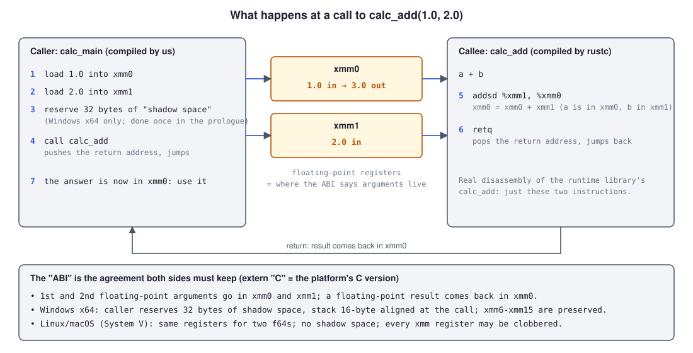
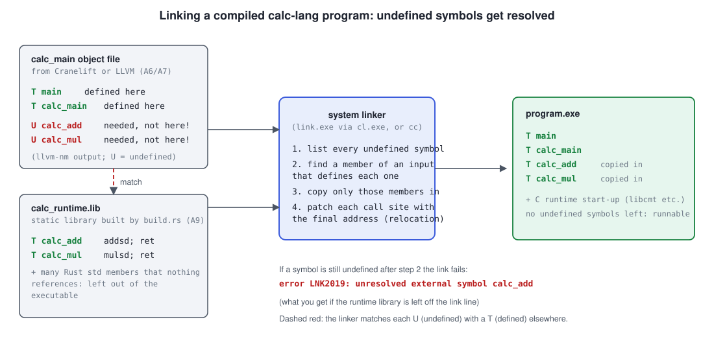

# A9 — Built-ins, kind 1: native Rust functions

**Session code**:
[`crates/calc-runtime/src/lib.rs`](../crates/calc-runtime/src/lib.rs),
[`crates/calc-compiler/build.rs`](../crates/calc-compiler/build.rs),
[`crates/calc-compiler/src/link_stub.rs`](../crates/calc-compiler/src/link_stub.rs),
[`crates/calc-ir/src/ast_to_ir.rs`](../crates/calc-ir/src/ast_to_ir.rs),
[`crates/calc-ir/src/ir.rs`](../crates/calc-ir/src/ir.rs), and both backends.
**Spec refs**: spec.md §7 (native Rust half of built-in bindings). **Prereqs**:
[A4](a4-mid-level-ir-and-lowering.md), [A6](a6-cranelift-codegen-backend.md) /
[A7](a7-llvm-codegen-backend.md), [A8](a8-backend-trait-and-feature-gating.md).

Until now every calc-lang program was compiled entirely into instructions the backend
generated itself: `1 + 2` became an `fadd`. A9 changes where *some* of the work lives.
The work of `+` and `*` is now done by two ordinary **Rust functions**, and the compiled
program **calls** them. Those functions are called **built-ins**: named operations the
language provides but the compiler doesn't spell out instruction by instruction.

Why bother, when `fadd` is right there? Because this is the mechanism the whole
DSL-Generator idea rests on (spec.md §7): a language author should be able to say "this
DSL has a `print` function that prints a formatted line" and hand the compiler a piece of Rust (later: C,
or a Python script) that does it, without teaching a code generator anything new. `+` and
`*` are just the smallest possible things to prove the mechanism on. A10 and A11 add the
other two ways to back a built-in (C libraries, and external programs).

- [What changed, in one paragraph](#what-changed-in-one-paragraph)
- [The new crate: `calc-runtime`](#the-new-crate-calc-runtime)
- [`extern "C"`, `#[no_mangle]` and the ABI](#extern-c-no_mangle-and-the-abi)
- [What a linker is, and how the compiled program finds `calc_add`](#what-a-linker-is-and-how-the-compiled-program-finds-calc_add)
- [How `CallBuiltin` changes each IR](#how-callbuiltin-changes-each-ir)
- [Position-independent code: the linker warning behind `is_pic=true`](#position-independent-code-the-linker-warning-behind-is_pictrue)
- [Recipe 5: call an imported function](#recipe-5-call-an-imported-function)
- [A built-in call vs. a user-defined call](#a-built-in-call-vs-a-user-defined-call)
- [What it costs, and what's deliberately not here](#what-it-costs-and-whats-deliberately-not-here)

## What changed, in one paragraph

calc-lang has no call syntax (`add(1, 2)` isn't valid), and a later session may never
give it one. So instead of inventing syntax, the existing operators route to the
built-ins: when `calc-ir`'s `lower()` sees `a + b` it emits a **`CallBuiltin`**
instruction naming `add`, and for `a * b` one naming `mul`. `-` and `/` have no built-in
yet and still lower to the inline `BinOp` from A4. From there:

```
source       (1 + 2) * 4
   │ parse, resolve            — unchanged: the AST still says BinOp(Add ...)
   ▼
calc-ir      CallBuiltin add, CallBuiltin mul
   ├─► interpreter   looks "add" up in calc-runtime's table and calls the Rust function
   └─► Cranelift / LLVM   emit a `call` to the symbol `calc_add` / `calc_mul`,
                          which the linker later finds in calc-runtime's static library
```

The generic `dslgen` tool will need real call syntax (`print(x)`), and when it
has that, a frontend can emit the *same* `CallBuiltin` node directly. That's why the node
is shaped like a call (a name plus any number of argument temps) and mentions nothing about
operators; the only calc-lang-specific line is the small `builtin_for` function in
`ast_to_ir.rs` that maps `Add` to `"add"` and `Mul` to `"mul"`.

## The new crate: `calc-runtime`

A **crate** is Rust's unit of compilation: a folder with a `Cargo.toml` and a `src/`,
producing either a library or a program. This workspace already had four (A0's
`calc-syntax`, `calc-ir`, `calc-compiler`, `calc-lsp`). A9 adds a fifth,
[`calc-runtime`](../crates/calc-runtime/), with no dependencies at all.

Why is it a crate of its own rather than a module in `calc-ir`? Because **three different
things need the same functions**:

1. the interpreter (`calc-ir`) calls them as ordinary Rust;
2. the compiler backends need to know their *names* and *shapes* to emit calls;
3. every compiled `.calc` program needs their *machine code* at run time.

Putting the code in a small leaf crate everything else depends on means there is exactly
one definition of what `add` does. (That is the same reason the interpreter is the
"oracle" from A5 on: when two implementations exist, they can disagree; when there is one
source, they can't.)

Here is the heart of it, [`calc-runtime/src/lib.rs`](../crates/calc-runtime/src/lib.rs):

```rust
#[no_mangle]
pub extern "C" fn calc_add(a: f64, b: f64) -> f64 {
    a + b
}

pub struct Builtin {
    pub name: &'static str,     // what the DSL calls it: "add"
    pub symbol: &'static str,   // what the linker calls it: "calc_add"
    pub arity: usize,           // how many arguments: 2
    pub eval: fn(&[f64]) -> f64, // how the interpreter runs it
}

pub static BUILTINS: &[Builtin] = &[
    Builtin { name: "add", symbol: "calc_add", arity: 2,
              eval: |args| calc_add(args[0], args[1]) },
    /* ... and mul ... */
];

pub fn lookup(name: &str) -> Option<&'static Builtin> { /* linear search */ }
```

Line by line, for someone who hasn't seen this before:

- `pub extern "C" fn calc_add(a: f64, b: f64) -> f64` is an ordinary function that adds two
  64-bit floating-point numbers. `pub` makes it visible outside the crate. The two
  attributes around it (`extern "C"`, `#[no_mangle]`) are what make it callable *from
  compiled code that wasn't written in Rust*; the next section explains them.
- `Builtin` is one row of a **manifest**: a table describing every built-in. It's
  deliberately just data. Names in this table are hardcoded for now; Part B replaces it
  with a `bindings.toml` file the language author writes (roadmap.md B-series, spec.md
  §7), and the rest of the compiler will read it the same way it reads this table.
- `eval: fn(&[f64]) -> f64` is a **function pointer**: a value that *is* a function. A
  table can hold one per row, which is what lets the interpreter run "the built-in named
  `add`" without a `match` on the name. `|args| calc_add(args[0], args[1])` is a
  **closure** (an inline anonymous function) that unpacks the argument slice and calls
  the real function; a closure that captures nothing coerces to a plain function pointer.
- `static BUILTINS: &[Builtin]` is a table that lives for the whole program, and
  `lookup` finds a row by its DSL name.

There's also a rule stated in the file's header comment: **it must stay self-contained**
(no other crates). The reason comes in the linker section: `build.rs` compiles this file
*by itself*, outside Cargo's dependency machinery.

## `extern "C"`, `#[no_mangle]` and the ABI

Two ideas: what the *caller* and *callee* agree on, and what the callee is *called*.

### The ABI: how a call physically happens

A CPU has no notion of "function with two `f64` arguments". It has a few dozen
**registers** (tiny, very fast storage slots) and a `call` instruction that jumps to an
address and remembers where to come back to. For `calc_main` (code the compiler
generated) to call `calc_add` (code `rustc` generated, possibly weeks apart, by a
different program) they must agree, with no shared source, on questions like:

- Where does the caller put the two numbers? (Which registers? On the stack?)
- Where does the answer come back?
- Which registers may the function scribble on, and which must it leave as it found them?
- Who cleans up the stack afterwards?

That agreement is the **ABI**, the *application binary interface*: an API, but at the level of
registers and bytes instead of source code. Every platform publishes one for C. On x86-64
Windows it's the "Microsoft x64" convention; on x86-64 Linux and macOS it's "System V".
For calling a function with two `f64` arguments, both come out the same way, and the
diagram shows the whole exchange:



These are the real instructions. [`llvm-objdump`](https://llvm.org/docs/CommandGuide/llvm-objdump.html)
on `calc_runtime.lib` shows the whole of `calc_add`, and on the Cranelift object for
`(1 + 2) * 4` shows the caller side (trimmed: the constants' `movabsq` loads are left out):

```text
calc_add:                              calc_main (from the Cranelift object):
  addsd  %xmm1, %xmm0    ; a += b        vmovq  %r8, %xmm0     ; xmm0 = 1.0
  retq                                   vmovq  %r8, %xmm1     ; xmm1 = 2.0
                                         movq   (%rip), %r9    ; address of calc_add, read from a slot
                                         callq  *%r9           ; call it
                                         ...                   ; result now in xmm0
```

Two things to notice. First, the function is *tiny*: the "call" exists purely for
plumbing. Second, `movq (%rip), %r9` reads the callee's address from a memory slot whose
contents aren't known yet. The compiler doesn't know where `calc_add` will end up in the
finished program; the linker fills that slot in, as described below. (Why the address is
read from a slot instead of being written into the instruction is the subject of
[Position-independent code](#position-independent-code-the-linker-warning-behind-is_pictrue).)

**What can go wrong**: if one side thinks the arguments arrive in `xmm0, xmm1` and the
other passes them somewhere else, the callee reads garbage; nothing complains, since by
this point the compiler has nothing left to check types against. That's why the backends
take care to use the platform's C convention: Cranelift's `Signature::new(module.isa().default_call_conv())`
and LLVM's default calling convention are both "the C convention of the host", the same
one `extern "C"` selects on the Rust side.

### `extern "C"`

Rust's *own* calling convention (what plain `fn` uses) is deliberately **unspecified**:
the compiler is free to change it between versions, reorder arguments, or pass a struct
in pieces to make code faster. That is good for Rust and useless for a contract with other
code. Writing `extern "C"` on a function tells `rustc`: "use the platform's C ABI for this
one". It's the standard bridge between Rust and everything else (A10 will use it in the
other direction, to call C libraries from Rust-side declarations).

### `#[no_mangle]` and symbols

After compilation, functions stop having source-level identity. What a compiled file
records instead is a **symbol**: a name attached to a location, so other code can refer
to it. `calc_main` calling `calc_add` is, in the object file, a note reading "at this
byte, put the address of the symbol named `calc_add`".

Rust normally **mangles** function names: `calc_runtime::calc_add` becomes something like
`_ZN12calc_runtime8calc_add17h3f2a...E` — the module path plus a hash, so two crates can
each have an `add` without clashing. Mangled names are great for Rust, and unguessable for
a code generator. `#[no_mangle]` turns that off: the symbol is exactly `calc_add`, the name
the manifest's `symbol` field records and the backends emit calls to. (You'll see it done
in the same file for `calc_mul`.)

You can see the result yourself with `llvm-nm`, which lists the symbols in a binary file
(`T` = defined here, in the code section; `U` = undefined, needed from elsewhere):

```text
$ llvm-nm calc_runtime.lib          $ llvm-nm calc_main_object.obj   (from Cranelift)
00000000 T calc_add                          U calc_add
00000000 T calc_mul                 00000000 T calc_main
                                             U calc_mul
                                    00000058 T main
```

## What a linker is, and how the compiled program finds `calc_add`

Back in A6 you saw that a backend produces an **object file**: machine code for the
functions the program defines, plus a table of symbols. An object file isn't runnable. It's
one *piece*. Program assembly is the **linker's** job (`link.exe` on Windows, `ld`/`lld`
on Linux, invoked through the `cc` crate in `link_stub.rs`):

1. take all the input pieces (object files, plus **libraries**, which are bundles of object
   files, also called archives; a **static library** is one whose contents get *copied into*
   the executable, rather than looked up when it runs);
2. make a list of every symbol that is **defined** somewhere and every symbol that is
   **used but not defined** in the file that uses it;
3. match every use to a definition, pulling in from libraries only the members that
   define something still needed;
4. lay everything out in memory and patch every use with the real address (the
   "relocation" of the address slot that `movq (%rip), %r9` reads, above);
5. add the small start-up code that runs before `main`, and write the executable.



**Before A9** an object file never had an undefined symbol, so the linker's job was
trivial. **Now** `calc_main`'s object file *declares* `calc_add` and `calc_mul` without
defining them (the backends call this an *import*), and the linker has to find them.
If nothing provides them, linking fails. You can provoke this by leaving the library off
the link line; the real message from MSVC is:

```text
p2.obj : error LNK2019: unresolved external symbol calc_add referenced in function calc_main
p2.obj : error LNK2019: unresolved external symbol calc_mul referenced in function calc_main
fatal error LNK1120: 2 unresolved externals
```

So there must be a library containing `calc_add`. That library has to come from
`calc-runtime`, and here's a wrinkle: when Cargo builds `calc-runtime` for the interpreter
it makes a Rust-specific `.rlib` file that only `rustc` understands. What a system linker
needs is a `.lib`/`.a`.

### `build.rs`: building the static library

A file named `build.rs` next to a `Cargo.toml` is a **build script**: a Rust program Cargo
compiles and runs *before* building the crate itself, and which can tell Cargo things
about the build. [`calc-compiler/build.rs`](../crates/calc-compiler/build.rs) does one job:

```rust
Command::new(rustc)
    .args(["--crate-type=staticlib", "--crate-name=calc_runtime"])
    .args(["--edition=2021", "-C", "opt-level=2", "-C", "panic=abort"])
    .arg("--target").arg(env::var("TARGET").expect("Cargo sets TARGET"))
    .arg("-o").arg(&archive)      // OUT_DIR/calc_runtime.lib (MSVC) or libcalc_runtime.a
    .arg(&runtime_src)            // ../calc-runtime/src/lib.rs
    .status()
```

It runs `rustc` by hand on `calc-runtime/src/lib.rs` with `--crate-type=staticlib`, which
means "produce a library a system linker can use". (That's why the file must be
self-contained: this bare `rustc` invocation knows nothing of Cargo's dependencies.)
`-C panic=abort` says a panic should just stop the program: no unwinding machinery is
needed by `a + b`. Then the last line of the script,

```rust
println!("cargo:rustc-env=CALC_RUNTIME_LIB={}", archive.display());
```

is how a build script talks to Cargo: this line asks Cargo to set an environment variable
while compiling `calc-compiler`, so `link_stub.rs` can write
`const RUNTIME_LIB: &str = env!("CALC_RUNTIME_LIB");` and have the path baked into the
`calcc` binary. (`rerun-if-changed` at the top of `build.rs` makes Cargo re-run it only
when `calc-runtime`'s source changes.)

### `link_stub.rs`: handing it to the linker

`link_stub::link` (A6's temporary link step) now adds `RUNTIME_LIB` to the linker's inputs,
right after the object file, on both the MSVC and the Unix-style paths:

```rust
cmd.arg(&object_path).arg(RUNTIME_LIB).arg("-o").arg(&exe_path);   // Unix-style
```

It always passes the library, even for a program that uses no built-ins. That's harmless
by step 3 above: the linker pulls in only archive members that define a needed symbol,
so an unused library adds nothing to the executable. (The archive is ~12 MB, since it's
a whole Rust standard library's worth of members, of which the two we need are a few bytes.)

This file is still labelled temporary: A12 replaces it with a real link driver that also
handles FFI libraries (A10) and the IPC shim (A11).

## How `CallBuiltin` changes each IR

Take one program, `(1 + 2) * 4`. All outputs below are real, printed by the code in this
repository (before is the A8 commit, after is A9); only Cranelift's hex constants are abbreviated (`0x1.0p0` for `0x1.0000000000000p0`).

### calc-ir (A4's IR)

Before, `+` and `*` were `BinOp` instructions:

```
Const   t0 = 1.0
Const   t1 = 2.0
BinOp   t2 = Add t0 t1
Const   t3 = 4.0
BinOp   t4 = Mul t2 t3        result: t4
```

After, the same shape, but two of the instructions are calls:

```
Const        t0 = 1.0
Const        t1 = 2.0
CallBuiltin  t2 = "add"(t0, t1)
Const        t3 = 4.0
CallBuiltin  t4 = "mul"(t2, t3)      result: t4
```

In Rust that's a new variant of `Instr` in [`ir.rs`](../crates/calc-ir/src/ir.rs):

```rust
CallBuiltin { dst: Temp, name: String, args: Vec<Temp> },
```

and one match arm in `lower_expr` that chooses between the two forms:

```rust
instrs.push(match builtin_for(*op) {
    Some(name) => Instr::CallBuiltin { dst, name: name.to_string(), args: vec![lhs, rhs] },
    None       => Instr::BinOp { dst, op: *op, lhs, rhs },
});
```

`args` is a `Vec`, so the same node can call something taking three arguments or none. The
test `lowering_emits_every_kind_of_instruction` pins all five instruction kinds
(`Const`, `BinOp`, `CallBuiltin`, `Copy`, `If`) to one small program, and its `match` has
no wildcard, so adding a sixth kind won't compile until the test is extended.

### Cranelift IR (A6)

Before (`fadd`/`fmul` inline):

```
v0 = f64const 0x1.0p0
v1 = f64const 0x1.0p1
v2 = fadd v0, v1
v3 = f64const 0x1.0p2
v4 = fmul v2, v3
return v4
```

After (one **signature** and one **function reference** per call, then `call`):

```
    sig0 = (f64, f64) -> f64 windows_fastcall
    sig1 = (f64, f64) -> f64 windows_fastcall
    fn0 = u0:1 sig0
    fn1 = u0:2 sig1

block0:
    v0 = f64const 0x1.0p0
    v1 = f64const 0x1.0p1
    v2 = call fn0(v0, v1)
    v3 = f64const 0x1.0p2
    v4 = call fn1(v2, v3)
    return v4
```

`sig0` says "two `f64`s in, one out, in the host's C convention" (the ABI again). `fn0` is
"the function with id `u0:1`, having that signature". `u0:1` is Cranelift's handle for the
*imported* `calc_add`; the name lives in the module, not in the function body.

This program shows two entries only because its two calls have different callees. A
program that calls the same built-in repeatedly repeats the entry: `1 + 2 + 3` gets
`fn0 = u0:1 sig0` and `fn1 = u0:1 sig1`, both naming `calc_add`. The backend asks Cranelift
to declare the callee once per *call*, and Cranelift doesn't merge duplicates (its own
source lists that as a TODO). It costs nothing in the output: the object file still has one
undefined `calc_add` symbol. LLVM has no equivalent, because a function declared in a module
can be called from anywhere, so the LLVM backend reuses a single `declare`.

### LLVM IR (A7)

Before, the interesting fact is that there was almost nothing to show: `inkwell`'s
builder constant-folds arithmetic on literals as it builds, so even the unoptimized IR
for `(1 + 2) * 4` was just

```
define double @calc_main() {
entry:
  ret double 1.200000e+01
}
```

After, the calls can't be folded (LLVM has no idea what `@calc_add` does), so they're all
there:

```
define double @calc_main() {
entry:
  %add = call double @calc_add(double 1.000000e+00, double 2.000000e+00)
  %mul = call double @calc_mul(double %add, double 4.000000e+00)
  ret double %mul
}

declare double @calc_add(double, double)

declare double @calc_mul(double, double)
```

A line starting `declare` is LLVM's spelling of "exists, defined elsewhere". Running
LLVM's full `-O2` pipeline (A7's optimizer test) leaves both calls in place, adding
only `tail`/`local_unnamed_addr` annotations. See the cost section below.

### The machine code

What Cranelift's `calc_main` becomes on x86-64 was shown above: each call is a
`movq (%rip), %r9`, which loads the callee's address from a memory slot the linker fills
in, followed by `callq *%r9`. (On Linux the relocation for that slot is listed as
`R_X86_64_GOTPCREL calc_add`, on Windows as `IMAGE_REL_AMD64_REL32 .refptr.calc_add`.)
Cranelift can't use a short relative `call` because the callee is not in the same object
file, so it can't assume the callee is within reach. The linker resolves the address once,
at link time; no name is looked up while the program runs, which is what "zero per-call
dispatch overhead" (spec.md §7) means here: the cost is one extra load per call. The next
section explains why the address comes from a slot at all.

## Position-independent code: the linker warning behind `is_pic=true`

The first time this session's code ran on Linux, the tests passed but the linker printed
two warnings for every program built by the Cranelift backend:

```text
/usr/bin/ld: calc_a9_link_test_cranelift.o: warning: relocation against `calc_add' in read-only section `.text'
/usr/bin/ld: warning: creating DT_TEXTREL in a PIE
```

The programs still ran. But the warnings point at something real, and fixing it changed
one line of the backend and the machine code shown above. The LLVM backend's objects
linked without any warning, so the difference is in what Cranelift was told to emit.

### Four terms

- **Relocation.** A note in an object file saying "at this byte, put the address of
  symbol X, once you know it". The compiler can't know final addresses; the linker (or the
  loader, at start-up) applies the notes. Every listing in this page that shows
  `R_X86_64_...` or `IMAGE_REL_...` is one.
- **PIE, and ASLR.** A **position-independent executable** (PIE) can be loaded at *any*
  address in memory. Operating systems use that to load each run at a random address
  (**ASLR**, address space layout randomization), which makes it much harder for an attack
  to rely on knowing where code lives. Modern Linux compilers produce PIE executables by
  default, which is why `cc` did here without being asked.
- **Position-independent code (PIC).** Machine code written so it works wherever it is
  loaded. The rule that makes it work: **never put an absolute address inside an
  instruction.** Instead, refer to other things *relative to the current instruction*
  (`(%rip)` in the listings means "relative to the instruction pointer"), or read an
  address from a table.
- **GOT.** The *global offset table*: a table of addresses in the data part of the program.
  The loader fills it in at start-up, once it knows where everything landed. PIC reads
  "the address of `calc_add`" from a GOT slot.

### What was wrong

With `is_pic=false` (what A6 set, and what this session inherited) Cranelift assumes the
program will be loaded at a fixed address, so it may write a callee's full 64-bit address
directly into the instruction:

```text
movabsq $0x0, %r9                       ; the address is part of the instruction
        R_X86_64_64   calc_add          ; "patch these 8 bytes of CODE with calc_add's address"
callq   *%r9
```

That is fine for a fixed-address program, but the linker had been asked for a PIE, whose
base address is chosen at start-up. So the address *inside the instruction* is wrong by
whatever the random offset turns out to be, and the loader has to fix it by writing into
the program's code. That is what the two warnings say: a relocation against `calc_add`
in `.text` (the code section, normally read-only), and so the linker had to mark the
executable **`DT_TEXTREL`**, an entry in the file's dynamic section meaning "this program
contains relocations in its code; make the code writable while loading".

```
   is_pic=false                                is_pic=true
   ────────────                                ───────────
   code:  movabsq $[ADDRESS], %r9              code:  movq (%rip), %r9      ← no address in code
                     ▲                                          │
   loader must WRITE ┘ into the code                            ▼
   (code pages become writable                  data:  GOT slot [ADDRESS]   ← loader writes here
    and can no longer be shared)                       (data is writable anyway)
```

Text relocations have real costs: the patched code pages are private to each process
instead of shared, loading is slower, and some hardened systems may refuse to run programs
that need them. It also defeats the point of a PIE, which is meant to be loadable anywhere
without touching the code.

### What changed

In `new_object_module` in
[`cranelift_backend.rs`](../crates/calc-compiler/src/cranelift_backend.rs), the flag went
from `flag_builder.set("is_pic", "false")` to `set("is_pic", "true")`, with a comment
explaining why. That is the whole code change. Only the way a built-in call gets its
address changes. Here are the real objects for `(1 + 2) * 4` (Linux ones generated by
pointing Cranelift at `x86_64-unknown-linux-gnu` and reading them with `llvm-objdump`),
showing the call to `calc_add`:

```text
                 before (is_pic=false)                    after (is_pic=true)
Linux:    movabsq $0x0, %r9                          movq   (%rip), %r9
          R_X86_64_64        calc_add                R_X86_64_GOTPCREL  calc_add
          callq  *%r9                                callq  *%r9

Windows:  movabsq $0x0, %r9                          movq   (%rip), %r9
          IMAGE_REL_AMD64_ADDR64  calc_add           IMAGE_REL_AMD64_REL32  .refptr.calc_add
          callq  *%r9                                callq  *%r9
```

- **Everything else in the function is identical.** `calc_main` is the same number of
  instructions (15 on Linux, 17 on Windows): only that one instruction differs, once per
  call. The call itself is still `callq *%r9`.
- **The address now lives in a table.** On Linux the relocation asks for the GOT entry of
  `calc_add`. On Windows, Cranelift creates a small pointer stub named `.refptr.calc_add`
  in the object and reads the address from there. The Windows object still links under
  MSVC and runs (the program exits with 12, as before).
- **The instruction is a little smaller** (7 bytes instead of 10), and it costs one extra
  memory read per call. For two calls that is nothing measurable.
- **The linker warning goes away**, because there is no longer an address inside the code
  to patch. I checked the objects, and the Windows link, locally; I could not run the Linux
  linker, so the absence of the warning on Linux is confirmed only by CI.

### Other ways to fix it, and why not

- **`-no-pie`** (link a fixed-address executable). It removes the warning without touching
  the objects, but it gives up ASLR for every program the compiler produces, and the
  LLVM backend, whose objects had no problem, would be made non-PIE too.
- **Mark the callee `colocated`.** That tells Cranelift the function will be linked into the
  same executable, and would likely produce a direct `call` instruction with no address
  load at all. It is a bigger change to the machine code, and it assumes the runtime is
  always statically linked, which A10 may not guarantee.

`is_pic=true` was chosen because it is the smallest change and works whichever way the
runtime is linked. `DECISIONS.md`'s A9 entry records this too.

### What didn't change

Earlier pages are left as written. A6's "Recipe 4" listing of `new_object_module()` and
the copy of that function in `tests/cranelift_recipes.rs` still show `is_pic` as `false`:
they describe the function as A6 wrote it. The real backend now differs from them in this
one flag. The recipes only build objects and never link them, so `false` is fine for what
they check.

## Recipe 5: call an imported function

A6/A7's recipes ended with one function calling another *defined in the same module*
(Recipe 3). This one is the difference A9 makes: calling a function the module **doesn't
define**. Each is a test, so it can't drift from working code: `recipe_5_calling_an_imported_function` in
[`tests/cranelift_recipes.rs`](../crates/calc-compiler/tests/cranelift_recipes.rs) and
[`tests/llvm_recipes.rs`](../crates/calc-compiler/tests/llvm_recipes.rs).

**Cranelift.** Declare the callee with `Linkage::Import` (rather than `Export` for
something we define), get a function reference for it inside the caller, and `call`:

```rust
let sig = f64_sig(&module, 2);                        // (f64, f64) -> f64
let calc_add = module
    .declare_function("calc_add", Linkage::Import, &sig)   // "someone else defines this"
    .unwrap();
// ... make `caller`'s FunctionBuilder `b` ...
let callee_ref = module.declare_func_in_func(calc_add, b.func);  // usable inside this function
let call = b.ins().call(callee_ref, &[one, two]);
let result = b.inst_results(call)[0];                    // a call returns a list of results
```

Real output, and the object file contains `calc_add` only as an undefined symbol:

```
function u0:0() -> f64 windows_fastcall {
    sig0 = (f64, f64) -> f64 windows_fastcall
    fn0 = u0:0 sig0

block0:
    v0 = f64const 0x1.0000000000000p0
    v1 = f64const 0x1.0000000000000p1
    v2 = call fn0(v0, v1)
    return v2
}
```

In the backend proper, this is the `Instr::CallBuiltin` arm of `lower_instr` in
[`cranelift_backend.rs`](../crates/calc-compiler/src/cranelift_backend.rs): it looks the
name up in `calc_runtime::lookup`, builds the signature from `builtin.arity`, declares
`builtin.symbol` as an import, and emits the `call`. Because declaring needs the module,
`module` is now threaded through `lower_block` and `lower_instr`.

**LLVM.** A function with no basic blocks is a declaration; add it with `add_function`
and call it with `build_call`:

```rust
let calc_add = module.add_function(
    "calc_add",
    f64_ty.fn_type(&[f64_ty.into(), f64_ty.into()], false),   // (double, double) -> double
    None,
);                                        // no basic blocks appended: a declaration
// ... in `caller`'s entry block ...
let result = builder
    .build_call(calc_add, &[one.into(), two.into()], "sum").unwrap()
    .try_as_basic_value().unwrap_basic();
```

which prints

```
declare double @calc_add(double, double)

define double @caller() {
entry:
  %sum = call double @calc_add(double 1.000000e+00, double 2.000000e+00)
  ret double %sum
}
```

`llvm_backend.rs` does this with `module.get_function(symbol)` first, so a program that
uses `+` twice declares `calc_add` once, not twice.

## A built-in call vs. a user-defined call

calc-lang has no user-defined functions yet, but it's worth knowing how the two differ,
since it's why `CallBuiltin` is its own instruction rather than a general `Call`:

| | user-defined function | built-in |
|---|---|---|
| where the body is | in the program's IR, compiled by our backend | outside the program: a Rust (later C, or external-process) function |
| what the call needs | a callee in the same compiled unit; its own parameters, locals, frame | only a name, an arity, and a symbol the linker can resolve |
| type checking | from the callee's declaration in source | from the manifest's signature (`arity`, all `f64` for now) |
| how the callee is found | the backend knows it (it just compiled it) | the linker finds it at link time (or the interpreter's table at run time) |

The interpreter side is the mirror image: a user-defined call would need a new environment
for the callee's variables (A5's `TempStore`), while a built-in call is
`(lookup(name).eval)(&args)` with nothing new to set up.

## What it costs, and what's deliberately not here

- **`+` and `*` are no longer inlined.** Before, LLVM's optimizer could fold `2 + 3 * 4`
  to `14` and Cranelift emitted a single `fadd`. Now each is a real call: a `call`, the
  callee's instruction and a `ret` instead of one instruction, and opaque to the optimizer. (LLVM could see through the
  call only if `calc_add`'s body were available to it, i.e. link-time optimization,
  which this project doesn't do.) That's a genuine tradeoff, accepted because A9's point
  is proving the mechanism; the DECISIONS entry records it. Real built-ins are things like
  `print`, which spawns a process per call, so a function call is noise.
- **No call syntax.** See "What changed": `dslgen` will want it, and can emit `CallBuiltin`
  directly. Nothing in this session's IR, interpreter or backends mentions operators.
- **A hardcoded list.** The manifest is a Rust `static`. The data-driven `bindings.toml`, and
  spec.md §7's validation of signatures at generation time, are Part B.
- **Only the C ABI on the host.** The backends use `default_call_conv()`; cross-compiling
  isn't a goal in v1.
- **The link step is still a stub.** `link_stub.rs` is replaced in A12.
- **Kinds 2 and 3 of built-ins** (C-ABI FFI, subprocess/IPC) are A10 and A11.

## Try it

```bash
cd calc-lang
cargo build
printf '(1 + 2) * 4' > prog.calc
./target/debug/calcc run --interpret prog.calc            # 12, via the Rust table
./target/debug/calcc build --backend=cranelift prog.calc -o prog && ./prog; echo $?   # 12
```

The exit code is the program's answer, as in A6 (real output waits for a later session).
Look at the symbols with `llvm-nm` if you have LLVM installed, or try building without the
library: temporarily remove the `.arg(RUNTIME_LIB)` in `link_stub.rs` and watch the linker
complain about `calc_add`.
